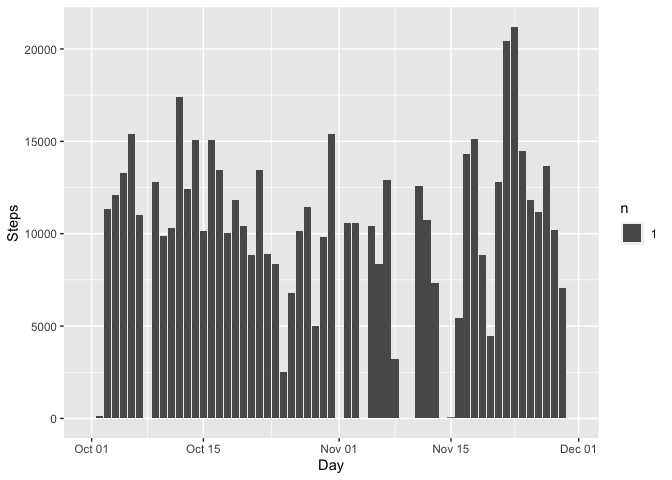
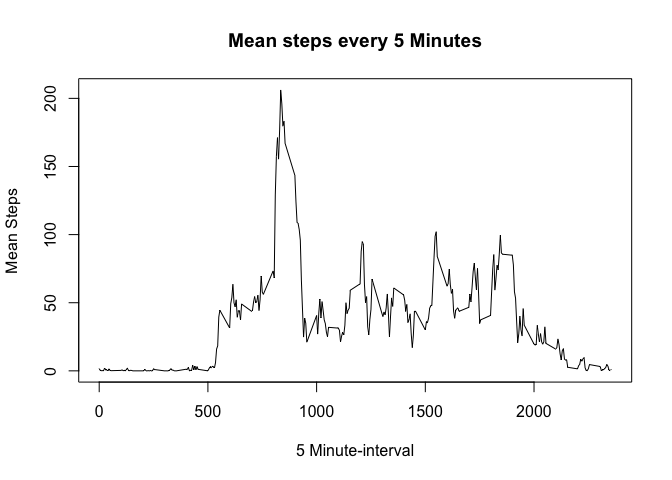
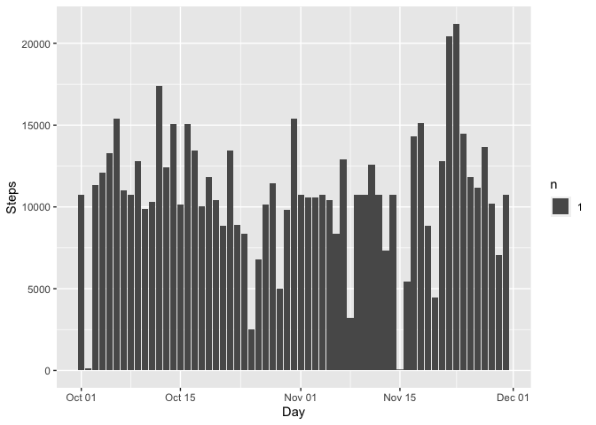
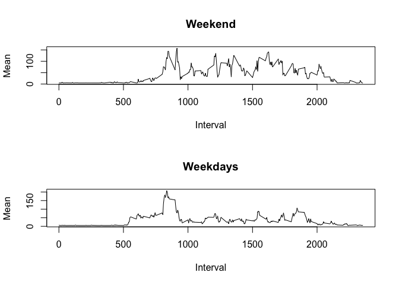

## Loading and preprocessing the data

In this section the data is read.


```r
data<-read.csv("activity.csv",sep=",")
```

## What is mean total number of steps taken per day?

In this section the mean and median of the total number of steps per day is calculated and the total number of steps taken each day is plotted.


```r
library(ggplot2)
list<- sapply(split(data$steps,data$date),sum,na.rm=TRUE)
df <- data.frame(names(list),list)
df$names.list. <- as.Date(df$names.list.)
mean0 <- mean(df$list,na.rm=TRUE)
median0 <- median(df$list,na.rm=TRUE)

g<-ggplot(df,aes(x=names.list.,y=list)) + geom_bar(stat="sum")+xlab("Day")+ylab("Steps")
print(g)
```

<!-- -->

The mean of the total number of steps taken per day is 9354.2295082 and the median is 10395

## What is the average daily activity pattern?

In this section the code graphs the daily activity pattern


```r
list2 <- sapply(split(data$steps,data$interval),mean,na.rm=TRUE)
df2 <- data.frame(names(list2),list2)
with(df2,plot(names.list2.,list2,xlab = "5 Minute-interval",ylab="Mean Steps",type="l",main="Mean steps every 5 Minutes"))
```

<!-- -->

The five interval that has the maximum mean is 830-835 minutes, which is around 1:00 pm.

## Imputing missing values

In this section the missing values are evaluated.


```r
library(dplyr)
```

```
## 
## Attaching package: 'dplyr'
```

```
## The following objects are masked from 'package:stats':
## 
##     filter, lag
```

```
## The following objects are masked from 'package:base':
## 
##     intersect, setdiff, setequal, union
```

```r
library(ggplot2)
na <- sum(is.na(data$steps))
mean2 <- mean(data$steps,na.rm=TRUE)
data1 <- mutate(data,steps= ifelse(is.na(data$steps),mean2,data$steps))

list1<- sapply(split(data1$steps,data1$date),sum,na.rm=TRUE)
df1 <- data.frame(names(list1),list1)
df1$names.list1. <- as.Date(df1$names.list1.)
mean1 <- mean(df1$list1,na.rm=TRUE)
median1 <- median(df1$list1,na.rm=TRUE)

g1<-ggplot(df1,aes(x=names.list1.,y=list1)) + geom_bar(stat="sum")+xlab("Day")+ylab("Steps")
print(g1)
```

<!-- -->

The total missing values are 2304  The new set, with no missing values has a mean equal to 1.0766189\times 10^{4} and the median is equal to 1.0766189\times 10^{4}  The value of the mean is the same as in the previous data set. The median is different by 1.19 units.

## Are there differences in activity patterns between weekdays and weekends?

In this section the activity patterns between weekdays and weekends is analyzed.


```r
library(stringr)
data1$date<-as.Date(data1$date)
weekdays <- c('Monday', 'Tuesday', 'Wednesday', 'Thursday', 'Friday')
data1$Weekday <- factor((weekdays(data1$date) %in% weekdays),levels=c(FALSE, TRUE), labels=c('Weekend', 'Weekday'))

list3<-sapply(split(data1$steps,list(data1$Weekday,data1$interval)),mean,na.rm=TRUE)
df3 <- data.frame(names(list3),list3)
names(df3)<-c("Weekday","Mean")
df3$Week <- str_split_fixed(df3$Weekday,".[0-9]+$",2)[,1]
df3$Interval <- str_split_fixed(df3$Weekday,"Week[A-z]+.",2)[,2]

g1 <-  filter(df3,df3$Week=="Weekend")
g2 <-  filter(df3,df3$Week=="Weekday")

par(mfrow=c(2,1))
with(g1,plot(Interval,Mean,type="l",main="Weekend"))
with(g2,plot(Interval,Mean,type="l",main="Weekdays"))
```

<!-- -->
